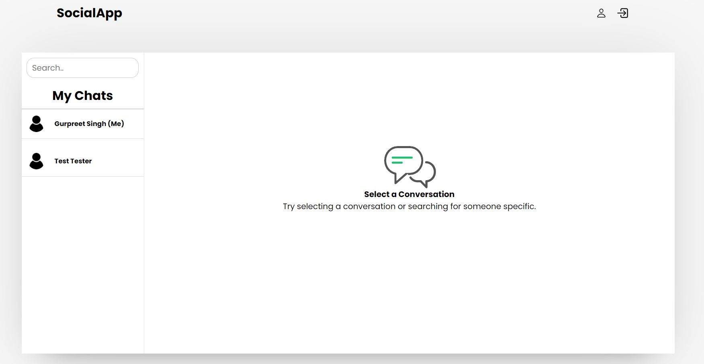
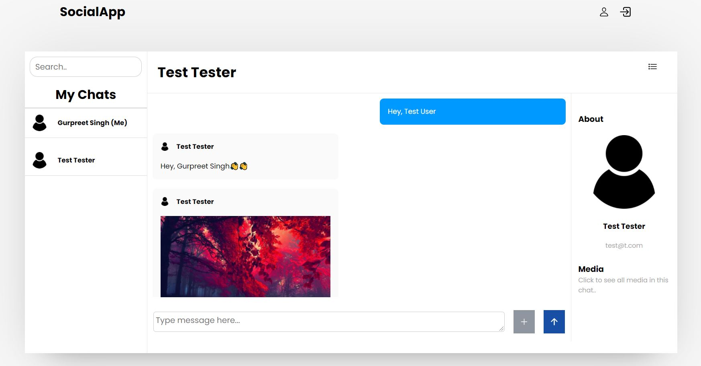

## Chat App

Chat App is web based application that allows us to chat with our friends and other peoples. This web page application is created with HTML, CSS, JavaScript and Nodejs and for database, I used MySQL.

### Install node dependencies

```

npm install

```

### Start server

```

npm start

```

### Run supervised server

Watch server for changes and restarts it if necessary

```

npm run supervisor
```

## Captures

Home page



Chat interface page


