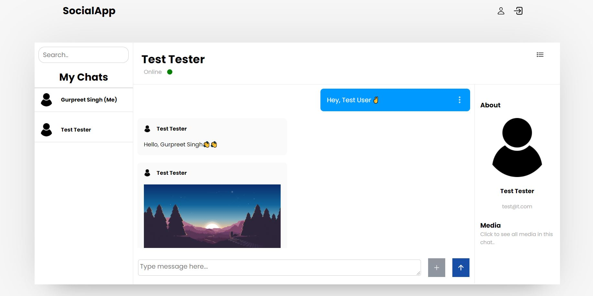

## Chat App

Social App is web-based application that allows us to chat with our friends and other peoples. This web page application is built with HTML, CSS, JavaScript, Nodejs and Web-Sockets. For database, I used MySQL.

### Install node dependencies

```

npm install

```

### Start server

```

npm start

```

### Run supervised server

Watch server for changes and restarts it if necessary

```

npm run supervisor
```

## Captures

Home page


Chat interface page


